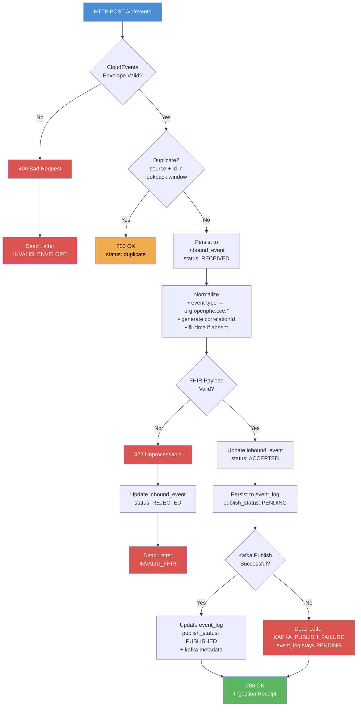
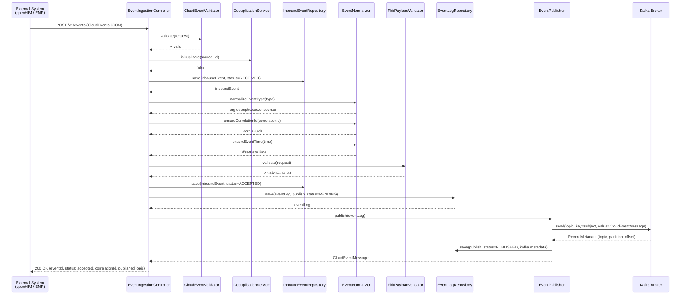
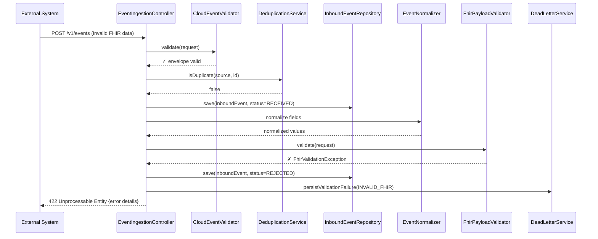
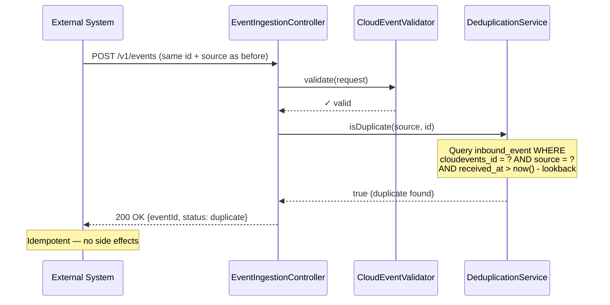
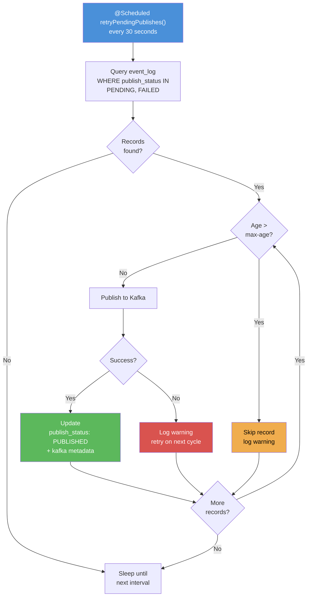
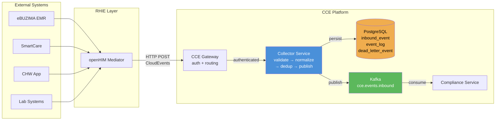
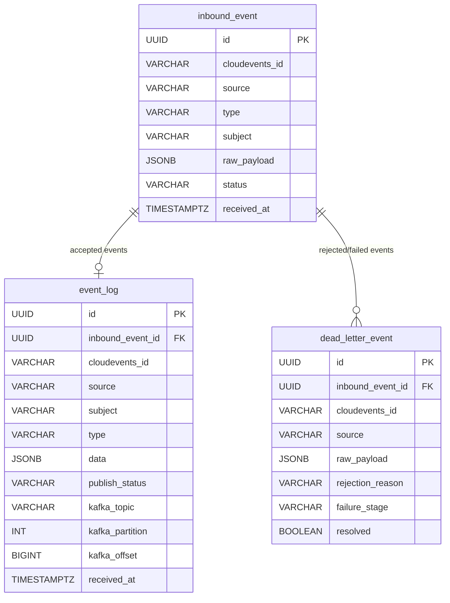
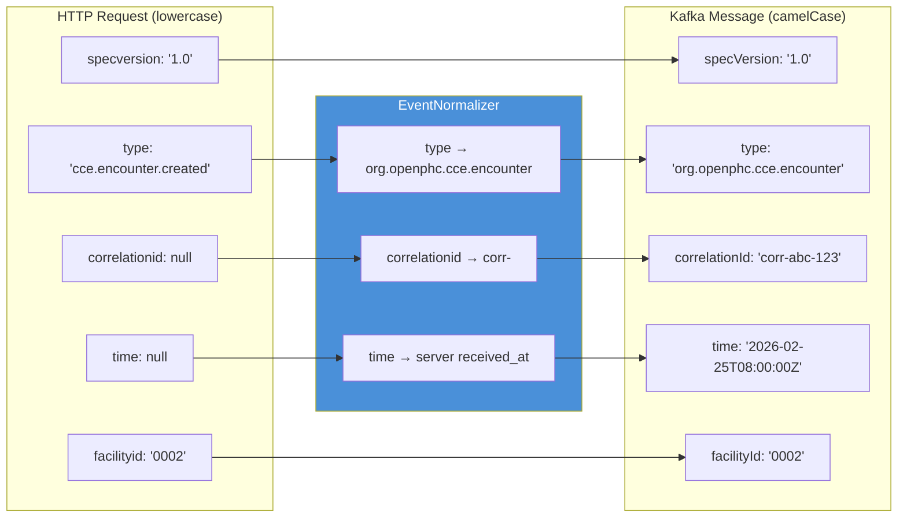

# CCE Collector Service — Flow Diagrams

Visual diagrams of the Collector Service's processing flows using Mermaid.

---

## 1. Event Ingestion Flow (Main Processing Pipeline)

---

## 2. Sequence Diagram — Successful Event Ingestion

---

## 3. Sequence Diagram — Validation Failure (FHIR)

---

## 4. Sequence Diagram — Duplicate Detection

---

## 5. Outbox Retry Flow

---

## 6. System Context — Data Flow

---

## 7. Database Entity Relationships

---

## 8. Field Transformation Pipeline

